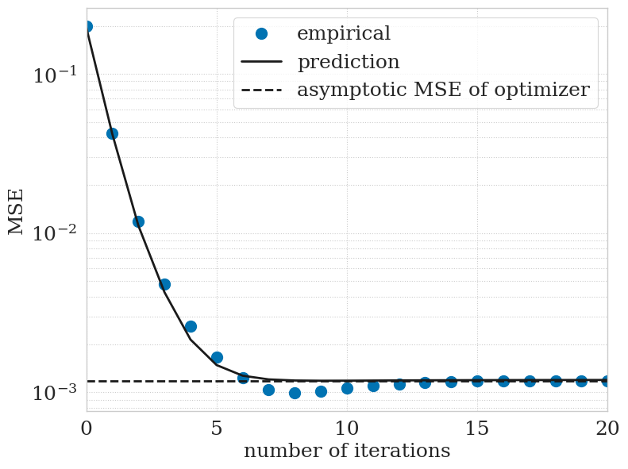

# predict-admm-cs

Python code of asymptotic performance prediction for ADMM (Alternating Direction Method of Multipliers)-based compressed sensing

Demo code:  

## Author

[Ryo Hayakawa](https://rhayakawa.github.io/index-e.html)

## Article

Ryo Hayakawa,  
"Asymptotic performance prediction for ADMM-based compressed sensing,"  
IEEE Transactions on Signal Processing, 2022.  
([IEEE Xplore](https://ieeexplore.ieee.org/document/9932009), [arXiv](https://arxiv.org/abs/2009.08545))

## Note

Although the ternary search has been used for the simulations in the paper, the golden-section search is used in this code.

## License

This project is licensed under the terms of the MIT license.
